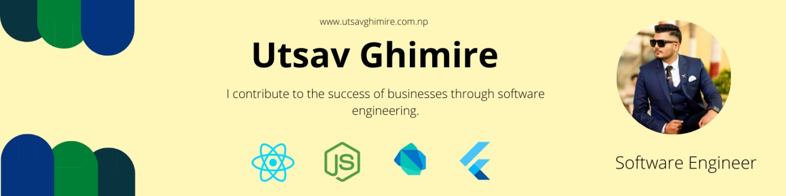
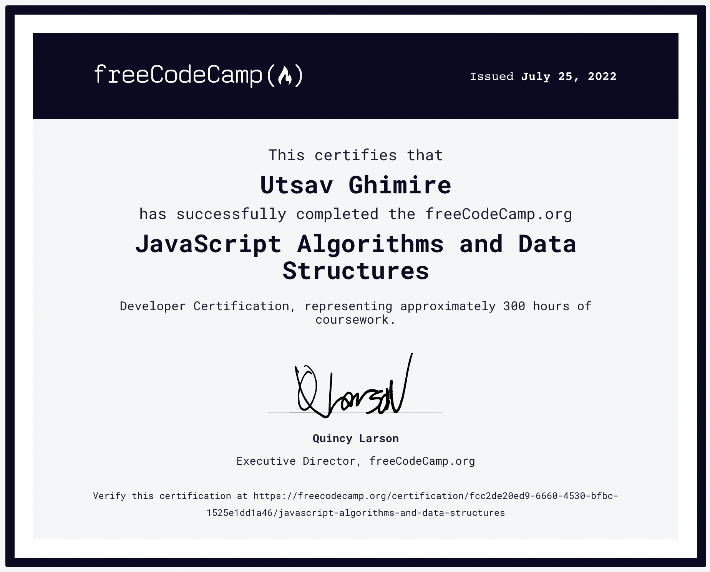

## Hi I'm Utsav 

- 😎 Started learning [Flutter](https://flutter.dev) since it's first stable version(v1.0.0).
- 💬 Ask me about: <b>Flutter, Dart, Go, Typescript</b>
- 😄 Pronouns: he/him/his
- ⚡ Fun fact: I am an introvert acting like I am not
- 💻 Most used line of code `git commit -m 'initial commit'`

### Connect with me:

 

### Stats

 

### Certifications

### Languages and Frameworks

<!-- TODO: Make technologies links takes you to repositories -->
     
   
 
### 📕 Blogs
- #### General
    - ##### [What is Blockchain?](https://blog.cryptostars.is/blockchain-the-future-619b81fa75e3) 
    
- #### Flutter
    - ##### [Dependency Injection in flutter](https://medium.com/p/afd560c06750) 
    - ##### [Why use map function instead of loops?](https://theutsavg1.medium.com/flutter-why-use-map-function-instead-of-loops-8a22c2444ece) 
    - ##### [Simple light animation using flutter](https://theutsavg1.medium.com/creating-beautiful-bulb-animation-with-flutter-3acda2a2c9e7) 
    - ##### [Flutter animations](https://theutsavg1.medium.com/zero-to-hero-in-flutter-animations-3c259834e83b) 
    - ##### [Clean Architecture in Flutter](https://medium.com/@theutsavg1/clean-architecture-in-flutter-8aadab851047) 
    - ##### [Generating clean architecture files with Dart](https://twitter.com/theutsavg/status/1565590503587848194?s=21&t=Ypgv2Ib6la4dlyyJXMG1rQ) 
    - ##### [Clean Architecture with Riverpod](https://medium.com/@theutsavg1/implementing-clean-architecture-with-riverpod-for-modular-flutter-apps-7d21acfa9db0) 
    - ##### [Interceptors in Flutter](https://medium.com/@theutsavg1/flutter-intercept-your-requests-8113ef39b4d9) 
    - ##### [Background tasks in Flutter](https://medium.com/@theutsavg1/flutter-background-tasks-dda02f98182) 
    - ##### [Managing Sessions in Flutter](https://medium.com/@theutsavg1/flutter-managing-sessions-13fe3f0850dc) 
    - ##### [Architectural overview of Flutter](https://medium.com/@theutsavg1/how-does-flutter-work-fbbc320d185d) 
- #### Go
    -  ##### [Go Clean Architecture with GIN and GORM](https://medium.com/@theutsavg1/developing-restful-api-with-go-and-gin-with-clean-architecture-61c526d42876) 
    -  ##### [Microservices in Go](https://github.com/Uuttssaavv/go-microservices) 

    
